# Vitor Odorico (@VitorOdorico)

  
  &nbsp;
  
  &nbsp;
  
  &nbsp;
  
  &nbsp;
  
  &nbsp;
  
  &nbsp;
  
  &nbsp;
  

---

### About me

Sou o Vitor Odorico, **Tech Lead / Full Stack**, focado em arquitetura, backend e integrações que sustentam produtos reais.

Sou **brasileiro**, falo **português** e **inglês**, e atuo principalmente com sistemas críticos — saúde digital, ERP e automações.

Gosto de projetos em que a tecnologia resolve um problema concreto: performance, confiabilidade e impacto no negócio.

Currently building:

- **PAP Healthcare** → plataforma de monitoramento hospitalar (KPIs, alertas e criticidade) com Spring, React e Oracle
- **PEER Reabilita** → solução de protocolos e reabilitação (TEA / ABA) com Laravel e React
- **QUALIX / Aurenza** → ERP municipal SaaS multi-tenant com Java 21, Spring Boot, React e MySQL

---

### Stats

  

---

<h3 align="left">Connect with me:</h3>

  
  
  
  

<h3 align="left">Languages and Tools:</h3>

  
  
  
  
  
  
  
  
  
  
  
  
  
  
  
  
  
  
  
  
  
  
  
  
  
  
  
  
  
  
  

---

Isso é só uma introdução rápida.

👉 Currículo: [baixar PDF](https://drive.google.com/file/d/1XRvdjEq7grJqtVql2clFx6iYwUFId74P/view?usp=sharing)

### Contact

  
  
  

